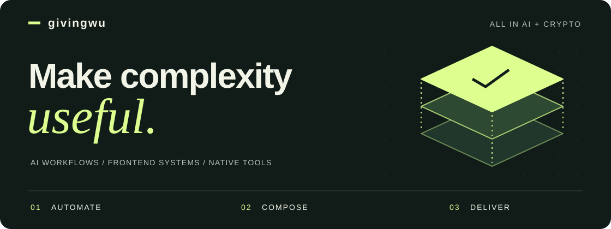

<picture>
  <source media="(max-width: 600px)" srcset="./assets/profile-hero-mobile.svg">
  
</picture>

# 👋 I build tools that remove friction.

**My edge: connecting AI workflows, reusable frontend architecture, and native product delivery.**

From code review automation to chat SDKs and macOS utilities, I turn recurring problems into tools others can adapt and use.

## 🛠️ What I bring

| Capability | Work you can inspect |
| :--- | :--- |
| **⚡ Automate workflows** | [ai-code-reviewer](https://github.com/givingwu/ai-code-reviewer) — A Dify/GitLab review workflow extended with frontend standards, webhooks, and bot notifications. Builds on [zgldh's upstream project](https://github.com/zgldh/dify-gitlab-mr-reviewer). |
| **🧩 Design for reuse** | [bifrost-chat](https://github.com/givingwu/bifrost-chat) — A React + TypeScript chat SDK with dependency injection, composable UI, and separate server/client state. [Explore the components ↗](https://givingwu.github.io/bifrost-chat/) |
| **🚀 Deliver native tools** | [NotchVeil](https://github.com/givingwu/NotchVeil) — A native macOS menu bar utility with configurable wallpaper edges and a Chinese/English interface. [Preview release ↗](https://github.com/givingwu/NotchVeil/releases) |

## 🌱 Open-source track record

**[wx-ble](https://github.com/givingwu/wx-ble)**  

**[vue-virtualized-table](https://github.com/givingwu/vue-virtualized-table)**  

**[vue-mfe](https://github.com/givingwu/vue-mfe)**  

🔎 Explore the projects

- **[wx-ble](https://github.com/givingwu/wx-ble)** — Peer-to-peer Bluetooth communication for WeChat Mini Programs.
- **[vue-virtualized-table](https://github.com/givingwu/vue-virtualized-table)** — A virtualized table component for Vue.js.
- **[vue-mfe](https://github.com/givingwu/vue-mfe)** — A starting point for Vue.js micro frontend apps.

## 🤝 Let's build something useful

Let's connect over **new ideas, useful tools, and interesting problems**.

**[💬 Connect on X ↗](https://x.com/giving_wu)** · [✍️ Read my blog](https://givingwu.github.io/) · [💻 Browse all repositories](https://github.com/givingwu?tab=repositories)

> 富在术数，不在劳身。利在势局，不在力耕。 —《盐铁论》
